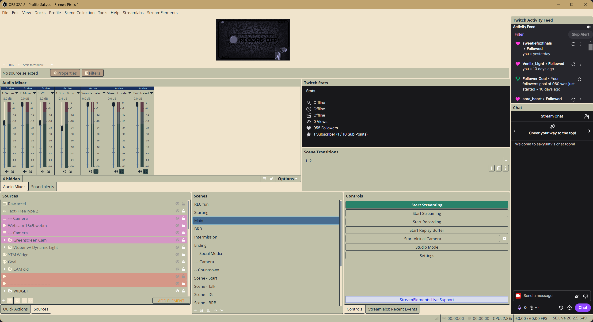

# OBS Studio Katsushika Hokusai x Miku Theme

A **Katsushika Hokusai x Hatsune Miku inspired light theme for OBS Studio**, based on the **Yami Default** theme.

## Why I made this

I wanted an OBS Studio theme that matched the aesthetic of the **Katsushika Hokusai x Miku setup by Darren**, which I discovered through his content.

It quickly became one of my favorite **light themes**, so I decided to adapt the style to OBS Studio.

This theme was created with the help of AI and is designed to keep the original Yami Default appearance while replacing its color palette with colors inspired by the **Katsushika Hokusai x Miku** setup.

> **Recommendation:** For the intended look, I strongly recommend using this theme with **Windows Light Mode enabled**. The preview image was captured with Windows Dark Mode enabled, so it does not represent the recommended setup.

## Installation

### Windows

1. Download the theme files from this repository.
2. Open your OBS Studio themes folder:

```text
C:\Program Files\obs-studio\data\obs-studio\themes\
```

3. Drag and drop the downloaded theme files into the `themes` folder.
4. If Windows asks whether you want to replace existing files, confirm it.
5. Restart OBS Studio.

> If your OBS Studio installation is located somewhere else, open your OBS installation directory and navigate to `data\obs-studio\themes\`.

### Enable Katsushika Hokusai

Once the files are installed:

1. Open **OBS Studio**.
2. Go to **Settings → Appearance**.
3. Select **Yami Default** as the theme.
4. Select **Katsushika Hokusai** as the theme variant.
5. Click **Apply** or **OK**.

For the best match with the original setup, also make sure **Windows Light Mode** is enabled.

That's it. Your OBS Studio interface should now use the Katsushika Hokusai x Miku inspired color palette.

## Preview



> The preview was captured with Windows Dark Mode enabled. **Windows Light Mode is recommended** for the intended appearance.

## Credits

* **Original inspiration:** [Katsushika Hokusai x Miku theme](https://github.com/MrDLingters/Katsushika-Hokusai-x-Miku-theme) by **Darren Lingters**.
* **Darren Lingters:** [GitHub](https://github.com/MrDLingters/Katsushika-Hokusai-x-Miku-theme) · [YouTube](https://www.youtube.com/@darrenlingters3512)
* **Yami Default:** Original OBS Studio theme developed by [Warchamp7](https://github.com/Warchamp7).
* This OBS Studio theme was created with AI assistance.

I discovered the original theme through Darren's YouTube channel, and this project is my OBS Studio adaptation of its visual style.

## Notes

This project is a color customization of the existing Yami Default theme. It does not aim to replace the original OBS Studio theme.

The theme is primarily designed to complement the **Katsushika Hokusai x Miku** aesthetic and works best when paired with **Windows Light Mode**.

If you encounter any issues or have suggestions for improvements, feel free to open an issue on this repository.
